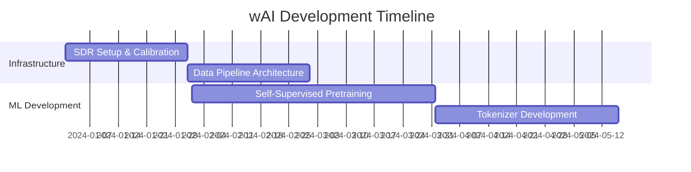

# wAI: Wave-based Artificial Intelligence
## Learning and Understanding the Electromagnetic Language of Our World

[](https://opensource.org/licenses/MIT)
[](https://github.com/yourusername/wAI)

---

## 📡 Executive Summary

**wAI (Wave-based AI)** represents a paradigm shift in artificial intelligence - a system that learns, interprets, and communicates through electromagnetic waves as a fundamental language. By treating RF signals not as mere data streams but as a rich, undiscovered linguistic system, wAI opens access to information dimensions beyond human perception.

### Core Vision
Transform electromagnetic radiation patterns into a universal language that AI can learn, enabling:
- Discovery of hidden communication protocols in nature
- Real-time health monitoring through bioelectromagnetic signals
- Predictive maintenance via side-channel emissions
- Cosmic signal interpretation and dark matter detection

---

## 🌍 1. Introduction

### 1.1 The Invisible Information Continent

Human perception captures less than 0.0001% of the electromagnetic spectrum. Meanwhile, every biological system, electronic device, and cosmic phenomenon continuously broadcasts information through electromagnetic waves. wAI aims to decode this vast, untapped information space.

### 1.2 Core Proposition

> **"RF signals are not noise - they are an undiscovered language waiting to be understood."**

Key principles:
- **Waves as Language**: Amplitude, frequency, phase, and polarization combinations form grammatical structures
- **AI's Fifth Sense**: Waveform → Features → Embeddings → Meaning
- **Discovery Engine**: Extract patterns from "noise" to generate and name new concepts

---

## 🏗️ 2. Technical Architecture

### 2.1 System Pipeline

```
Sensing → Preprocessing → Pretrain → Alignment → Concept Induction → Application
```

### 2.2 Core Components

#### A. Multi-Domain Sensing Layer
```python
class WaveformSensor:
    """
    Hardware abstraction for multi-domain RF acquisition
    - SDR: 70 MHz to 6 GHz (USRP B200/210)
    - Biomedical: EEG/ECG/EMG (OpenBCI compatible)
    - Cosmic: Radio telescope integration
    - Environmental: EM field arrays
    """
    def __init__(self):
        self.sample_rate = 100e6  # 100 MHz
        self.center_freq = 2.4e9  # Configurable
        self.gps_sync = True       # GPSDO for timing
```

#### B. Signal Processing & Tokenization
```python
class RFTokenizer:
    """
    Transform continuous waves into discrete semantic tokens
    - Multi-resolution STFT/Wavelet transforms
    - Phase-amplitude coupling (PAC) extraction
    - Polarization state analysis
    - VQ-VAE based quantization
    """
    def tokenize(self, iq_stream):
        # Extract I/Q components
        # Apply wavelet scattering (Kymatio)
        # Generate embedding vectors
        return tokens, grammar_tree
```

#### C. Self-Supervised Learning Framework
```python
class WaveTransformer:
    """
    State-space models (S4/Mamba) for long-range dependencies
    - Masked autoencoding on spectrograms
    - Contrastive learning (SimCLR/CPC) on I/Q streams
    - Physical invariance constraints (Maxwell equations)
    - Cross-frequency attention mechanisms
    """
    def pretrain(self, tokenized_waves):
        # Dual-stream architecture
        # 1D-Conv for raw waveforms
        # Vision Transformer for spectrograms
        return wave_embeddings
```

#### D. Cross-Modal Alignment
```python
class MultiModalAligner:
    """
    Connect RF patterns with observable phenomena
    - RF ↔ Text/Image/Video (CLIP-like architecture)
    - RF ↔ Behavioral states
    - RF ↔ Biomarkers
    - RF ↔ Environmental events
    """
    def align(self, rf_embeddings, external_data):
        # Contrastive learning across modalities
        return aligned_representations
```

---

## 🔬 3. Domain Applications

### 3.1 Biological & Ecological Systems

#### Insect Communication Networks
**Goal**: Decode electromagnetic signatures of collective intelligence

**Technical Approach**:
- 3-axis accelerometer + E-field sensing on ant colonies
- Pheromone event synchronization markers
- RF-behavior contrastive learning

**Expected Outcomes**:
- Communication token extraction
- Swarm decision-making protocols
- Bio-inspired robotics algorithms

**Feasibility**: High (2-3 years)

### 3.2 Industrial & IoT Systems

#### Predictive Maintenance via Side-Channel Analysis
**Goal**: Non-invasive equipment health monitoring

**Technical Stack**:
```yaml
Hardware:
  - Near-field probes
  - Spectrum analyzers
  - Temperature-synchronized logging
  
ML Pipeline:
  - Anomaly detection (Isolation Forest + VAE)
  - Failure mode tokenization
  - Remaining useful life prediction
```

**ROI**: 30-50% reduction in unplanned downtime

**Feasibility**: Very High (Immediate - 1 year)

### 3.3 Biomedical Applications

#### Non-Invasive Neural-Organ Communication
**Goal**: Decode electrical signals between brain and organs

**Key Signals**:
- Vagus nerve activity (anti-inflammatory reflex)
- Enteric nervous system (gut-brain axis)
- Cardiac autonomic regulation

**Clinical Applications**:
- Closed-loop neuromodulation
- Early disease detection
- Personalized therapeutic stimulation

**Feasibility**: Medium (2-4 years, requires IRB approval)

### 3.4 Cosmic & Astrophysical Phenomena

#### Dark Matter Distribution Mapping
**Goal**: Detect subtle EM perturbations from dark matter interactions

**Methodology**:
- Ultra-sensitive phase/polarization analysis
- Long-baseline interferometry
- ML-based pattern separation from cosmic noise

**Impact**: Revolutionary insights into universe structure

**Feasibility**: Challenging (3-7 years)

---

## 💻 4. Implementation Roadmap

### Phase 1: Foundation (Months 0-6)


### Phase 2: Domain Pilots (Months 7-12)
- Industrial: Side-channel PoC with 3 factory partners
- Biological: Insect colony monitoring (n=5 species)
- Medical: IRB preparation for human studies
- Cosmic: Public dataset reanalysis (Pulsar/FRB)

### Phase 3: Integration & Scaling (Months 13-24)
- SDK/API release
- Multi-domain knowledge graph
- Real-time inference optimization
- Community dataset platform

---

## 🛠️ 5. Technical Stack

### Core Dependencies
```python
# requirements.txt
torch>=2.0.0          # Deep learning framework
scipy>=1.10.0         # Signal processing
gnuradio>=3.10        # SDR interface
kymatio>=0.3.0        # Wavelet scattering
mamba-ssm>=1.0.0      # State-space models
physionet-tools       # Biomedical data
astropy>=5.0          # Astronomical processing
```

### Hardware Requirements
| Component | Specification | Purpose |
|-----------|--------------|---------|
| SDR | USRP B200/210 | Wideband RF capture |
| GPS | GPSDO module | Time synchronization |
| Compute | NVIDIA A100 GPU | Model training |
| Storage | 100TB NAS | Raw waveform archive |

---

## 📊 6. Performance Metrics

### Key Performance Indicators (KPIs)

#### Signal Quality Metrics
- **SNR Improvement**: >20 dB through denoising
- **Compression Ratio**: 100:1 with <5% reconstruction error
- **Tokenization Efficiency**: 1 MHz bandwidth → 1000 tokens/second

#### Discovery Metrics
- **Novel Pattern Detection Rate**: >10 patterns/month per domain
- **Cross-validation Success**: >80% reproducibility
- **Human-interpretable Concepts**: >60% of discovered patterns

#### Application Impact
- **Predictive Accuracy**: AUC >0.85 for anomaly detection
- **Lead Time**: 48-hour advance warning for equipment failure
- **Biological Insight**: 5x increase in detected communication events

---

## 🔐 7. Ethics & Safety Framework

### 7.1 Privacy Protection
```python
class PrivacyGuard:
    def __init__(self):
        self.blocked_frequencies = load_protected_bands()
        self.encryption = AES256()
        self.anonymizer = DataAnonymizer()
    
    def process(self, raw_signal):
        # On-device processing only
        # No raw signal storage
        # Differential privacy applied
        return safe_embeddings
```

### 7.2 Regulatory Compliance
- Frequency allocation adherence (FCC/ITU)
- GDPR/CCPA for biometric signals
- IRB approval for human studies
- Environmental impact assessment

### 7.3 Dual-Use Prevention
- API rate limiting
- Use-case authentication
- Audit logging
- Model card documentation

---

## 🌟 8. Scientific Breakthroughs Expected

### Near-term (1-2 years)
1. **Industrial Revolution 4.0+**: Zero-downtime factories via predictive EM signatures
2. **Ecological Insights**: Complete mapping of electromagnetic animal communication
3. **Health Monitoring**: Non-invasive, continuous organ function assessment

### Medium-term (3-5 years)
1. **Interspecies Communication**: Human-animal-plant information exchange protocols
2. **Quantum Biology**: EM role in biological quantum processes
3. **Space Communication**: Ultra-low power interplanetary networks

### Long-term (5-10 years)
1. **Dark Matter Detection**: Indirect observation via EM perturbations
2. **Consciousness Studies**: Neural field dynamics and awareness
3. **Technological Telepathy**: Direct brain-to-brain EM communication

---

## 🔬 9. Minimum Viable Experiments (MVEs)

### MVE-1: Insect Colony Intelligence
```yaml
Objective: Decode ant electromagnetic communication
Setup:
  - 3-axis E-field sensors around colony
  - Synchronized video + pheromone markers
  - 72-hour continuous recording
  
Success Criteria:
  - Extract 50+ distinct EM patterns
  - Correlate with 80% of collective decisions
  - Predict swarm behavior 10 seconds ahead
```

### MVE-2: Machine Health Signatures
```yaml
Objective: Predictive maintenance via side-channel EM
Setup:
  - Monitor 10 industrial motors
  - Induce controlled failures
  - Build failure signature library
  
Success Criteria:
  - 95% fault detection accuracy
  - 48-hour advance warning
  - <1% false positive rate
```

### MVE-3: Bio-RF Markers
```yaml
Objective: Non-invasive health monitoring
Setup:
  - Wrist-worn RF sensor
  - Correlate with medical-grade devices
  - n=30 participants, 4-week study
  
Success Criteria:
  - Sleep stage accuracy >85%
  - Stress detection AUC >0.80
  - Heart rate variability correlation >0.90
```

---

## 🚀 10. Getting Started

### Quick Start
```bash
# Clone repository
git clone https://github.com/yourusername/wAI.git
cd wAI

# Install dependencies
pip install -r requirements.txt

# Download sample data
python scripts/download_samples.py

# Run basic RF tokenization
python examples/rf_tokenizer_demo.py

# Train small model
python train.py --config configs/starter.yaml
```

### Docker Deployment
```dockerfile
FROM nvidia/cuda:11.8.0-base-ubuntu22.04
RUN apt-get update && apt-get install -y \
    python3-pip \
    gnuradio \
    libuhd-dev
COPY . /wAI
WORKDIR /wAI
RUN pip install -r requirements.txt
CMD ["python", "serve.py"]
```

---

## 📚 11. Mathematical Foundations

### Information-Theoretic Framework

**Compression as Understanding**:
```
L(model) + L(residual) << L(data) ⟹ Pattern exists
```

**Predictive Modeling**:
```
x_{t+1} = f_θ(x_{≤t}) + ε, minimize E[||ε||²]
```

**Control Theory Integration**:
```
u_t = π_φ(x_{≤t}), minimize J = ∑_{t=0}^T c(x_t, u_t)
```

**Law Discovery via Sparse Regression**:
```
min_F ||ẋ - F(x)||² + λ||F||_0
```

---

## 🤝 12. Contributing

We welcome contributions from researchers, engineers, and enthusiasts across all domains!

### How to Contribute
1. Fork the repository
2. Create your feature branch (`git checkout -b feature/AmazingFeature`)
3. Commit changes (`git commit -m 'Add AmazingFeature'`)
4. Push to branch (`git push origin feature/AmazingFeature`)
5. Open a Pull Request

### Priority Areas
- Domain-specific tokenizers
- Real-time inference optimization
- Cross-modal alignment algorithms
- Safety and ethics frameworks
- Documentation and tutorials

---

## 📖 13. References & Resources

### Key Papers
1. **State-Space Models**: "Mamba: Linear-Time Sequence Modeling with Selective State Spaces" (2023)
2. **Neural Operators**: "Fourier Neural Operator for Parametric PDEs" (2020)
3. **RF-ML**: "Over-the-Air Deep Learning Based Radio Signal Classification" (2018)
4. **Bio-EM**: "Electromagnetic Fields as Structure-Function Zeitgebers" (2022)

### Datasets
- RadioML 2016/2018: Modulation recognition benchmark
- PhysioNet: Biomedical waveforms
- NASA Exoplanet Archive: Cosmic signals

### Tools & Libraries
- GNU Radio: Software-defined radio
- PyTorch: Deep learning
- Kymatio: Wavelet scattering
- OpenBCI: Neurotechnology platform

---

## 📬 14. Contact & Community

- **GitHub Issues**: Bug reports and feature requests
- **Discord**: [Join our community](https://discord.gg/wAI)
- **Email**: wai-dev@example.com
- **Twitter**: [@wAI_project](https://twitter.com/wAI_project)

---

## 📄 15. License

This project is licensed under the MIT License - see the [LICENSE](LICENSE) file for details.

---

## 🎯 16. Vision Statement

> "wAI is not just a technology project - it's a civilization-scale initiative to equip humanity with a sixth sense. By learning the electromagnetic language of our universe, we open doors to understanding that transcend human perception. From the whispers of ant colonies to the heartbeat of distant galaxies, wAI will reveal the hidden conversations that surround us."

**— The wAI Team**

---

*Last updated: January 2025*